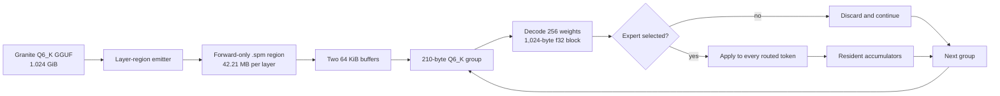
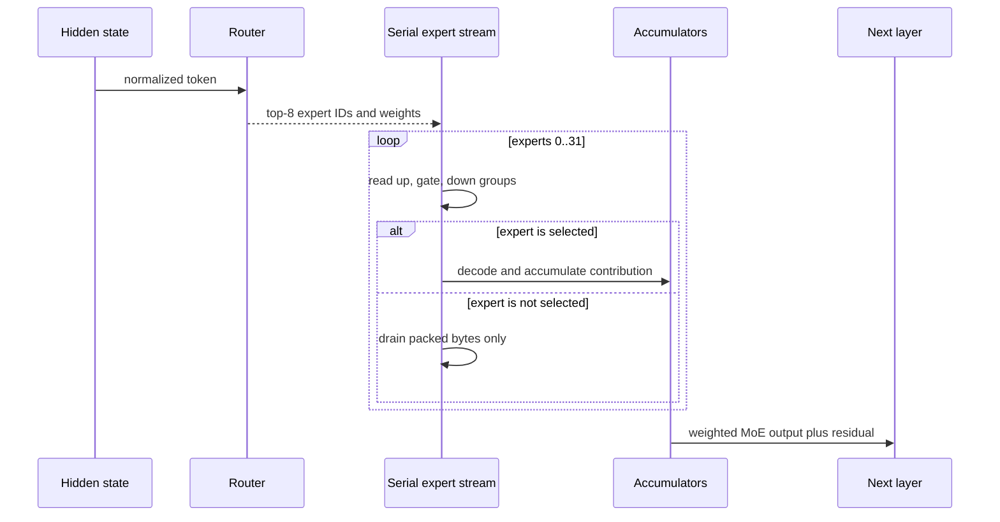
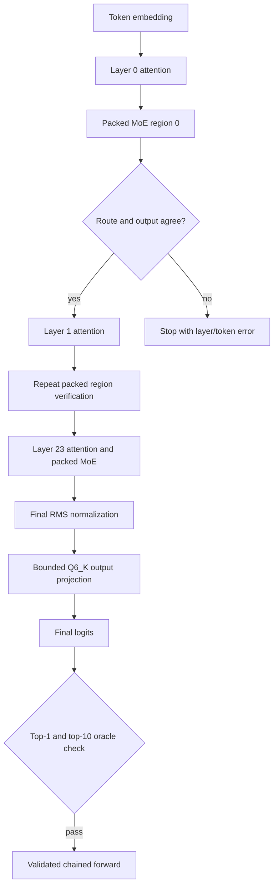
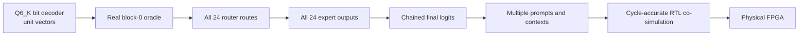

# Full packed MoE forward validation

The packed Q6_K path now verifies every Granite 3.1 1B-A400M MoE layer and
feeds each streamed result into the next transformer block. The final logits
therefore include accumulated streamed expert output rather than merely 24
independent block comparisons.

Run `scripts/verify-granite-moe-full` to reproduce the canonical one-token
experiment. The large layer artifact is written to `/disk1/tmp` and replaced
at every layer. The reported 24-layer byte count is the logical size of the
complete expert stream.

## Architecture

The router is evaluated first. Experts then arrive in stable ID order from 0
through 31. Every expert is read, but arithmetic occurs only for tokens routed
to it. No component can seek backward inside a layer region.

## Full-model measured result

Canonical token `8279`, release build, warm Linux filesystem cache:

| Measure | Result |
|---|---:|
| transformer layers verified | 24 |
| logical packed MoE bytes | 1,013,097,984 |
| useful selected bytes | 255,688,704 |
| useful fraction | 25.24 percent |
| physical scratch artifact | 42,212,416 bytes |
| layer-region transitions | 23 |
| mid-region rewinds | 0 |
| packed group residency | 210 bytes |
| peak input path including buffers | 132,306 bytes |
| conservative activation bound | 18,432 bytes/token |
| f32 KV contribution | 98,304 bytes/token |
| artifact emission | 4,340.5 ms |
| expert-region reads | 364.1 ms |
| Q6_K decode | 220.2 ms |
| scalar expert arithmetic | 1,466.4 ms |
| complete command wall time | 8.814 s |
| maximum expert absolute error | 0.00097656 |
| maximum combined absolute error | 0.00097656 |

Emission is experimental setup, not inference. It is large because 24 logical
regions are copied through one scratch file and because dirty-page writeback
varies. A production artifact would be emitted once.

The packed router selected exactly the same top-8 expert IDs as the direct
GGUF path at every layer. All streamed MoE outputs remained within the 0.002
absolute all-layer limit. Layer 23 has the largest absolute difference because
its intermediate magnitudes are much larger; the canonical block-0 difference
remains 0.00000334.

The final chained-stream result preserves the oracle's top token, `444`, and
9 of its top 10 tokens. The top logit changed from `9.099242210` on the direct
GGUF path to `9.099257469` after all streamed expert results were chained.

## Flow across all layers

Attention and the final output projection continue to read bounded ranges
directly from GGUF. This step specifically replaces and chains every MoE expert
calculation through `.spm`; it does not yet claim that every non-MoE parameter
uses the `.spm` container.

## RTX 5060 Ti capacity

The local GPU reports 16,311 MiB total VRAM and compute capability 12.0. The
entire source GGUF is about 1.024 GiB, and the logical packed expert stream is
about 966 MiB. Either representation fits easily. They do not both need to be
resident in production.

At f16, Granite KV cache costs 48 KiB per token; at f32 it costs 96 KiB. Even a
32K f16 context is about 1.5 GiB, leaving ample room for this model, CUDA work
buffers, and runtime overhead within 16 GB. Capacity is not the immediate
bottleneck for this model. The important experiment is whether serial transfer
and expert reuse can make larger models economical.

## What is validated, and what remains

Today the work is strongly software-validated through stage E:

- original Q6_K blocks are copied without pickle, Python, or requantization;
- container sizing and encoding have unit coverage;
- a real maintained model supplies all weights and activations;
- every layer's selected expert IDs match an independent llama.cpp-derived
  route oracle through the direct GGUF Rust path;
- every streamed expert output is compared before being chained forward;
- final logits retain the established top-1 and 9/10 top-token agreement;
- the reader exposes forward consumption and rewind only, and measured
  mid-region rewinds are zero;
- parameter residency is measured rather than inferred.

Short of programming an FPGA, the strongest remaining validation is a
cycle-accurate RTL or hardware-shaped simulator consuming these exact `.spm`
bytes, checked against Rust for many randomized tensors, prompts, routes, and
batch sizes. Error injection should demonstrate that truncation, bad encoding,
wrong order, and route mismatch fail loudly. Multiple real prompts and longer
KV-backed contexts are also needed before calling this model-runtime validated
rather than architecture-prototype validated.

## Animated demonstration

An animated browser view is feasible. The neighboring `../ml-viz` project is
a Rust/Yew visualization scaffold, while `../sw-mlpl` already supplies inline
SVG primitives, trace JSON, a Yew/WASM web surface, and demo registry tooling.

The recommended division is:

1. Rust exports a small JSON trace containing layer, expert ID, selected token
   IDs, packed bytes, useful bytes, and read/decode/compute timing.
2. MLPL can generate static measured charts and inspect the trace.
3. Yew animates blocks moving from storage through the 210-byte decoder into
   selected expert accumulators, with live counters for residency, wasted
   bandwidth, reuse, and elapsed time.

This keeps measured data authoritative in Rust while using MLPL for analysis
and Yew/SVG for presentation. The animation should toggle between resident,
all-expert serial, and selected-union schedules so the value proposition is
visible rather than merely stated.
