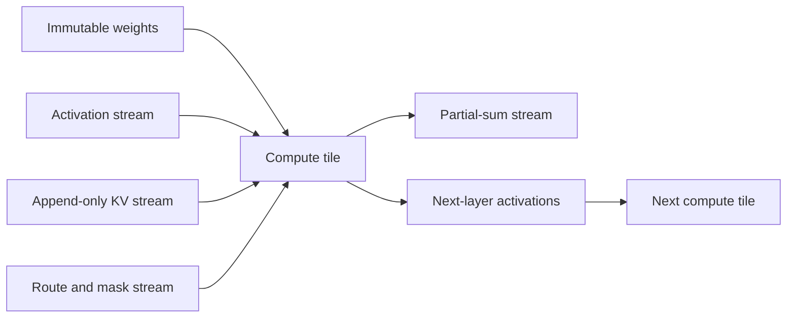
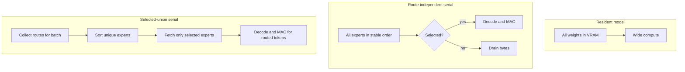

# What else can we stream? An ELI5 guide

Serial processing is not merely "put expert weights on disk." It is a design
rule: arrange data in the order the machine consumes it, keep only the small
working piece nearby, and reuse that piece as much as possible before letting
it go.

Imagine preparing meals in a tiny food truck. A conventional GPU kitchen buys
a huge refrigerator so every ingredient is within arm's reach. A serial
machine has a delivery belt. Ingredients arrive in recipe order, the cooks use
each ingredient for several meals, and the empty container leaves. The food
truck needs less expensive space, but a late or badly ordered delivery can
stop every cook.

## The things that can flow



### Weights: the easiest stream

Weights do not change during inference. Matrix weights can be laid out in the
exact order that multiply-accumulate lanes consume them. Expert weights are
especially attractive because the router enables only some experts.

The catch is reuse. Reading a weight once for one token wastes bandwidth. A
batch lets the machine apply that weight to several resident activation
vectors before advancing the belt.

Embeddings and output heads are less naturally serial. An input token asks for
one arbitrary embedding row, while output logits usually ask for every row.
Useful alternatives are a small hot-token cache, vocabulary partitioning,
hashed embeddings, or a separate random-access memory bank for embeddings
while the large transformer matrices remain sequential.

### Activations: pass the partly built meal forward

Activations are the temporary numbers produced between layers. They can stream
in several ways:

- **Layer pipeline:** layer 0 sends tiles directly to layer 1 instead of
  writing a complete tensor to external memory.
- **Row or channel tiles:** keep a slice of the hidden dimension in SRAM/BRAM,
  finish all operations that can use it, and forward it.
- **Token pipeline:** different pipeline stages work on different tokens at
  the same time.
- **Operator fusion:** normalization, activation functions, scaling, and
  residual addition consume and produce one flowing tile without round trips
  to DRAM.

ELI5: instead of finishing 100 sandwiches, refrigerating them, and taking them
back out for wrapping, wrap each sandwich as soon as it leaves the grill.

The hard part is that some operations need information from the whole tensor.
Softmax needs a maximum and a sum. Normalization needs a sum of squares.
Those can still stream using two passes or online algorithms: first accumulate
small statistics, then normalize during a second pass. The trade is another
read versus storing the entire activation.

### KV cache: append easily, revisit carefully

Autoregressive attention appends one key and value per new token. Appending is
naturally sequential. Reading is harder because each new query attends to old
tokens.

Complementary approaches include:

- process KV in blocks and maintain an online softmax;
- keep a recent sliding window on chip and stream older blocks;
- use ring attention across devices;
- compress or quantize old KV blocks;
- evict or summarize low-value history;
- use architectures with recurrent state, linear attention, or state-space
  models that replace a growing cache with fixed-size state.

For this Granite model, f16 KV costs 48 KiB per remembered token and f32 costs
96 KiB. Streaming weights does not eliminate KV growth; it changes which bill
dominates at long context.

### Router decisions and sparse metadata

Expert IDs, gates, masks, offsets, and token-to-expert lists are tiny streams.
They tell the datapath whether an arriving expert block should be decoded and
which activation lanes should receive it. Our compact route representation is
40 bytes per token: eight one-byte expert IDs plus eight `f32` weights.

This small control stream is what turns a blind conveyor belt into useful
sparse computation.

### Partial sums and accumulators

Outputs are accumulated while weights pass. Ideally accumulators remain in
BRAM or SRAM. If they are too large, partial sums can themselves stream to a
second bank or reduction tree.

Spilling partial sums is expensive: they are normally f32 and may be much
larger than quantized weights. Good schedules therefore spend scarce on-chip
memory on accumulators and activations before spending it on replaceable
immutable weights.

### Training state

Training can stream examples, gradients, optimizer shards, and parameter
tiles. Techniques such as gradient accumulation, optimizer-state sharding,
ZeRO, activation checkpointing, and offload all exchange memory capacity for
extra traffic or recomputation. Training is harder than inference because
weights change and the backward pass revisits earlier activations.

## Complementary serial/dataflow approaches

| Approach | Keep nearby | Stream | Main benefit | Main price |
|---|---|---|---|---|
| Weight streaming | activations and sums | immutable weights | tiny parameter residency | repeated weight traffic |
| Activation streaming/fusion | current tile | layer outputs | fewer DRAM round trips | scheduling constraints |
| Token batching | several activations | each weight once | weight reuse | latency and activation memory |
| Selected-expert grouping | routes and selected activations | selected expert union | avoids unused expert bytes | route-aware scheduling |
| Expert cache | popular experts | cache misses | handles skewed routing | cache complexity and misses |
| Double buffering | current and next tile | asynchronous refill | overlaps transfer/compute | twice the buffer memory |
| Systolic array | local partial sums | weights/activations between cells | predictable high reuse | rigid shapes and fill latency |
| Compression | decoder and tiny packed block | quantized bytes | less bandwidth/capacity | decode logic and error |
| Structured sparsity | mask and nonzero values | sparse blocks | fewer bytes and multiplies | metadata and irregularity |
| Recomputation | small checkpoints | regenerated activations | lower activation memory | more arithmetic |
| Pipeline parallelism | one stage per device | activations | scales model capacity | pipeline bubbles |
| Tensor parallelism | one matrix shard | reductions | more compute bandwidth | communication |
| Ring/block attention | query tile/statistics | KV blocks | bounded attention residency | repeated/remote KV traffic |
| State-space/recurrent models | fixed state | new tokens | no growing KV cache | different model behavior |

These are not mutually exclusive. A plausible accelerator uses packed Q6_K
weight streaming, route-aware token batching, double-buffered input, a
systolic or vector MAC core, on-chip accumulators, fused activation output,
and block-streamed KV.

## Three candidate accelerator schedules



Resident execution buys low latency with expensive fast memory. Blind serial
execution is simplest and never needs expert random access, but wastes 75
percent of expert traffic for one top-8-of-32 token. Selected-union execution
reduces traffic, but either storage needs expert-level addressing or an
upstream scheduler must construct the stream after routes are known.

A useful hybrid keeps a few frequently selected experts resident and streams
the long tail. Another hybrid reads all experts sequentially from bulk storage
into a small expert cache shared by several queued batches.

## Physics and economics

The lower bound remains:

```text
time >= max(bytes moved / bandwidth, operations / compute rate)
```

Energy often matters more than time. Moving a number from off-chip memory can
cost much more energy than multiplying it. Serial layouts reduce expensive
capacity, but they win economically only when compression and reuse prevent
the conveyor belt from moving the same mostly-unused data repeatedly.

The design knobs are therefore:

1. reduce bytes with quantization and sparsity;
2. increase uses per byte with batching and tiling;
3. overlap movement with compute using double buffering;
4. keep the truly reused working state on chip;
5. accept recomputation when arithmetic is cheaper than storage traffic.

## Future experiments worth doing

- Animate and measure FIFO occupancy under configurable storage and MAC rates.
- Replace the scalar Q6_K loop with SIMD, CUDA, then hardware-shaped lanes.
- Export multi-token traces and visualize expert popularity and cache hits.
- Add online-softmax KV block streaming and compare it with resident attention.
- Measure fused normalization/residual activation streaming.
- Simulate BRAM budgets and choose accumulator/activation tile sizes from real
  Gowin and larger FPGA device constraints.
- Generate RTL for the FIFO, Q6_K decoder, enable mask, MAC lanes, and BRAM
  accumulator; co-simulate it against the Rust trace.
- Explore models designed for streaming: recurrent/state-space layers,
  structured sparse MoE, low-rank experts, and shared expert bases.

The animated [serial-MoE FPGA visual emulator](../visualization/README.md)
shows the first of these schedules using measured Granite trace data.
